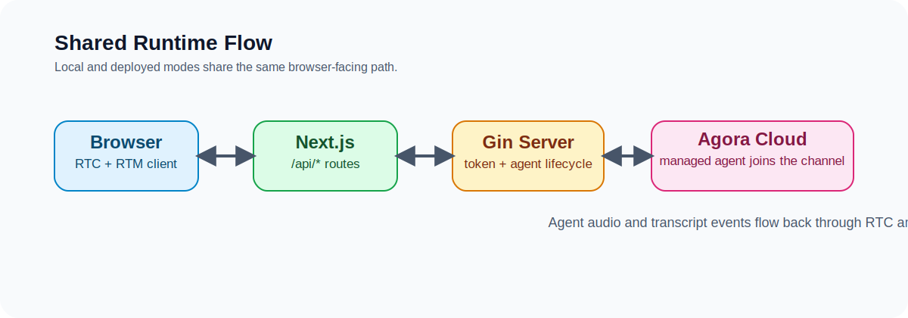

# Agora Conversational AI Go Quickstart

[](./LICENSE)
[](https://go.dev/)
[](https://pnpm.io/)

Build a production-style voice agent with a Next.js web client and a Go backend (Gin + Agora Agent Server SDK). Includes transcript + state updates over RTM and managed STT/LLM/TTS defaults.

## Prerequisites

- Go 1.23+
- [pnpm](https://pnpm.io/installation)
- [Agora CLI](https://www.npmjs.com/package/agoraio-cli)

## Run It

Install the CLI (skip if already installed), scaffold the Go quickstart, install dependencies, and run.

1. **Install the Agora CLI and sign in** (skip if `agora` is already on your PATH):

   ```bash
   curl -fsSL https://raw.githubusercontent.com/AgoraIO/cli/main/install.sh | sh -s -- --add-to-path
   agora login
   ```

2. **Scaffold and run** (replace `my-go-demo` with your own project name):

   ```bash
   agora init my-go-demo --template go
   cd my-go-demo
   make setup
   agora project env write server/.env.local --with-secrets
   make dev
   ```

3. Open [http://localhost:3000](http://localhost:3000) and click **Start conversation**.

If the agent does not join or transcripts do not appear, run **`agora project doctor --deep`**.

### Working from a clone of this repository

Use this path if you already cloned **this** repo:

```bash
git clone https://github.com/AgoraIO-Conversational-AI/agent-quickstart-go.git
cd agent-quickstart-go
agora login
agora project use <your-project>
make setup
agora project env write server/.env.local --with-secrets
make doctor-local
make dev
```

Services:

- Frontend: `http://localhost:3000`
- Backend: `http://localhost:8000`

## Deploy

Default deployment is `client` only (single target). In this mode, Next route handlers run in-process for:

- `/api/get_config`
- `/api/startAgent`
- `/api/stopAgent`

Required deployment env vars:

```bash
AGORA_APP_ID=your_agora_app_id
AGORA_APP_CERTIFICATE=your_agora_app_certificate
AGENT_GREETING=optional_custom_greeting
```

Leave `AGENT_BACKEND_URL` unset in deployment unless you intentionally want to proxy to an external backend.

To export env values from your Agora CLI-bound project:

```bash
agora project use <your-project>
agora project env write server/.env.local --with-secrets
rg "^(AGORA_APP_ID|AGORA_APP_CERTIFICATE)=" server/.env.local
```

## Environment variables

Primary backend env file: [`server/.env.example`](server/.env.example).

| Variable | Required | Default | Notes |
| --- | :---: | :---: | --- |
| `AGORA_APP_ID` | ✅ | — | Agora Console -> Project -> App ID |
| `AGORA_APP_CERTIFICATE` | ✅ | — | Agora Console -> Project -> App Certificate (server only) |
| `AGENT_GREETING` |  | built-in greeting | Optional opening line override |
| `PORT` |  | `8000` | Gin backend port |
| `AGENT_BACKEND_URL` (local proxy mode) | ✅ (local proxy mode) | `http://localhost:8000` | Used by frontend scripts in local Go-backed mode |

> **Runtime modes** — local mode proxies Next `/api/*` routes to Gin (`AGENT_BACKEND_URL=http://localhost:8000`). Single-target deploy mode runs those routes in-process in Next.

## Commands

```bash
# Dev
make setup
make dev

# Quality
make doctor
make doctor-local
make fmt
make test

# CI / pre-ship
make verify-web
make verify-local
make verify
```

Run `make verify` for web-focused changes, and `make verify-local` when backend/proxy behavior changes.

## Architecture

<picture>
  <source media="(prefers-color-scheme: dark)" srcset="./.github/images/system-architecture-dark.svg">
  
</picture>

The browser always calls Next `/api/*` routes. In local mode those routes proxy to Gin through `AGENT_BACKEND_URL`; in deployment they run directly in Next. Both modes keep the same browser contract.

## What You Get

- `client/` Next.js client with voice conversation UI
- `server/` Gin backend using official Agora Agent Server SDK for Go
- stable `/api/get_config`, `/api/startAgent`, `/api/stopAgent` browser contract
- combined RTC + RTM token generation from `AGORA_APP_ID` + `AGORA_APP_CERTIFICATE`

## How It Works

1. Browser requests config from `/api/get_config`.
2. Backend returns app ID, channel, user UID, agent UID, and token.
3. Browser joins RTC/RTM and streams audio.
4. Browser calls `/api/startAgent`; backend starts the cloud agent session.
5. Browser receives transcript/state updates; `/api/stopAgent` ends the session.

## Repo Map

- `client/` — Next.js 16 + React 19 + TypeScript frontend
- `server/` — Gin backend + Agora Agent Server SDK integration
- `ARCHITECTURE.md` — system flow and runtime modes
- `AGENTS.md` — contributor agent instructions

## Troubleshooting

- **`make doctor-local` fails:** confirm Go 1.23+ and non-empty `AGORA_APP_ID` + `AGORA_APP_CERTIFICATE` in `server/.env.local`.
- **Credentials missing:** run `agora project env write server/.env.local --with-secrets`.
- **Frontend cannot reach backend in local mode:** confirm `make dev` is running and frontend uses `AGENT_BACKEND_URL=http://localhost:8000`.
- **Agent does not join channel:** verify the selected Agora project has Conversational AI managed provider support enabled.
- **Unsure who owns `/api/*`:** local mode proxies to Gin; deployed mode runs handlers in-process unless `AGENT_BACKEND_URL` is set.

## More Docs

- [ARCHITECTURE.md](./ARCHITECTURE.md)
- [AGENTS.md](./AGENTS.md)
- [docs/ai/L1/02_architecture.md](./docs/ai/L1/02_architecture.md) — full-stack topology and lifecycle
- [docs/ai/L1/03_code_map.md](./docs/ai/L1/03_code_map.md) — curated `client/` + `server/` file map

## License

Released under the [MIT License](./LICENSE).
